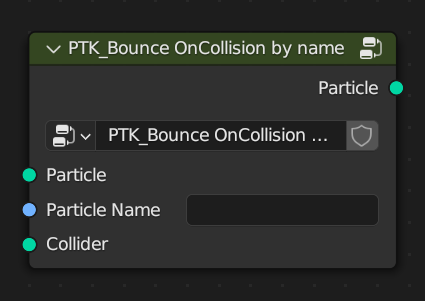

PTK_Bounce OnCollision by name
==============================

.. _PTK_Bounce_OnCollision_by_name:

=====
Input
=====

**Particle**

**Particle Name**

**Collider**

======
Output
======

**Particle**
