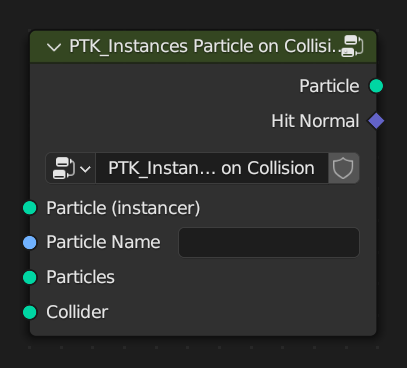

PTK_Instances Particle on Collision
===================================

.. _PTK_Instances_Particle_on_Collision:

=====
Input
=====

**Particle (instancer)**

**Particle Name**

**Particle**

**Collider**

======
Output
======

**Particles**

**Hit Normal**
