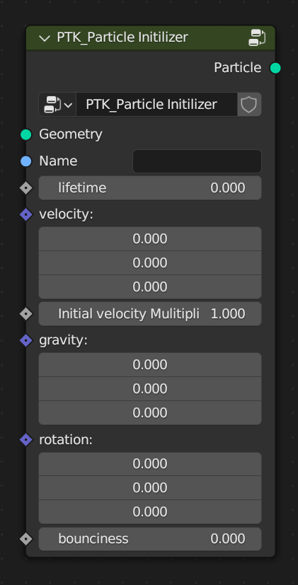

PTK_Particle Initilizer
=======================

.. _PTK_Particle_Initilizer:

=====
Input
=====

**Geometry**

**Name**

**lifetime**

**velocity**

**Initial velocity Multiplier**

**gravity**

**bounciness**

======
Output
======

**Particle**
